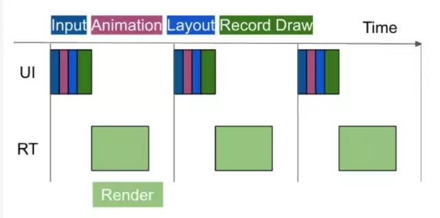
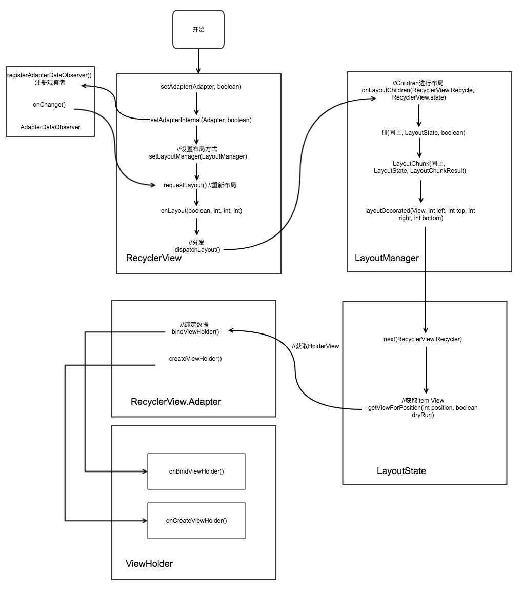

# RecyclerView 源码
* RecyclerView.LayoutManager 负责视图的布局(线性，Grid，瀑布流)
* ItemDecoration控制着间隔，分割线之类的
* ItemAnimator控制着动画

# Adapter 负责RecyclerView的缓存等
### 1、每一个item就是一个ViewHolder 

* 通过桥接模式，使RecyclerView 将布局方式独立成LayoutManager，实现对布局的定制化。
* 通过组合模式，使RecycleView通过dispatchLayout对Item View进行布局绘制的。
* 通过适配器模式，ViewHolder将RecycleView与ItemView联系起来，使得RecycleView方便操作ItemView。
* 通过观察者模式，给ViewHolder注册观察者，当调用notifyDataSetChanged时，就能重新绘制。
 ```java
    @Override
    protected void onLayout(boolean changed, int l, int t, int r, int b) {
        //计算diapatchLayout的性能开销
        TraceCompat.beginSection(TRACE_ON_LAYOUT_TAG);
        dispatchLayout();
        TraceCompat.endSection();
        mFirstLayoutComplete = true;
    }

    void dispatchLayout() {
        if (mAdapter == null) {
            Log.e(TAG, "No adapter attached; skipping layout");
            // leave the state in START
            return;
        }
        if (mLayout == null) {
            Log.e(TAG, "No layout manager attached; skipping layout");
            // leave the state in START
            return;
        }
        mState.mIsMeasuring = false;
        if (mState.mLayoutStep == State.STEP_START) {
            dispatchLayoutStep1();
            mLayout.setExactMeasureSpecsFrom(this);
            dispatchLayoutStep2();
        } else if (mAdapterHelper.hasUpdates() || mLayout.getWidth() != getWidth() || mLayout.getHeight() != getHeight()) {
            // First 2 steps are done in onMeasure but looks like we have to run again due to
            // changed size.
            mLayout.setExactMeasureSpecsFrom(this);
            dispatchLayoutStep2();
        } else {
            // always make sure we sync them (to ensure mode is exact)
            mLayout.setExactMeasureSpecsFrom(this);
        }
        dispatchLayoutStep3();
    }
 ```
* 有待实践验证

void | compatibleWithPrevious |  removeAndRecycleViews  
-|-|-
setAdapter | false（clear()清除数据） | "true(会调用removeAndRecycleViews旧的item会被回收重新用)" |
swapAdapter | true(不清除数据) | "输入值（false，那么全部的item都会被重新创建）" |

# RecyclerView的预取功能(Prefetch)
这个功能是rv在版本21之后自带的，也就是说只要你使用了21或者之后版本的rv，那么就自带该功能，并且默认就是处理开启的状态，通过LinearLayoutManager的setItemPrefetchEnabled()我们可以手动控制该功能的开启关闭，但是一般情况下没必要也不推荐关闭该功能，预取功能的原理比较好理解，如图所示



# RecyclerView的自定义方法




```java
 public RecyclerView(Context context, @Nullable AttributeSet attrs, int defStyle) {
        super(context, attrs, defStyle);
        if (attrs != null) {
            TypedArray a = context.obtainStyledAttributes(attrs, CLIP_TO_PADDING_ATTR, defStyle, 0);
            mClipToPadding = a.getBoolean(0, true);
            a.recycle();
        } else {
            mClipToPadding = true;
        }
        setScrollContainer(true);
        setFocusableInTouchMode(true);
        final int version = Build.VERSION.SDK_INT;
        mPostUpdatesOnAnimation = version >= 16;

        final ViewConfiguration vc = ViewConfiguration.get(context);
        mTouchSlop = vc.getScaledTouchSlop();
        mMinFlingVelocity = vc.getScaledMinimumFlingVelocity();
        mMaxFlingVelocity = vc.getScaledMaximumFlingVelocity();

        //这个方法也就是标记一下这个View是否需要自己重新绘制，默认情况下不设置。
        // 只有设置不滚动才要自己去绘制
        
        setWillNotDraw(ViewCompat.getOverScrollMode(this) == ViewCompat.OVER_SCROLL_NEVER);

        mItemAnimator.setListener(mItemAnimatorListener);
        initAdapterManager();
        initChildrenHelper();
        // If not explicitly specified this view is important for accessibility.
        if (ViewCompat.getImportantForAccessibility(this)
                == ViewCompat.IMPORTANT_FOR_ACCESSIBILITY_AUTO) {
            ViewCompat.setImportantForAccessibility(this,
                    ViewCompat.IMPORTANT_FOR_ACCESSIBILITY_YES);
        }
        mAccessibilityManager = (AccessibilityManager) getContext()
                .getSystemService(Context.ACCESSIBILITY_SERVICE);
        setAccessibilityDelegateCompat(new RecyclerViewAccessibilityDelegate(this));
        // Create the layoutManager if specified.

        boolean nestedScrollingEnabled = true;

        if (attrs != null) {
            int defStyleRes = 0;
            TypedArray a = context.obtainStyledAttributes(attrs, R.styleable.RecyclerView,
                    defStyle, defStyleRes);
            String layoutManagerName = a.getString(R.styleable.RecyclerView_layoutManager);
            int descendantFocusability = a.getInt(
                    R.styleable.RecyclerView_android_descendantFocusability, -1);
            if (descendantFocusability == -1) {
                setDescendantFocusability(ViewGroup.FOCUS_AFTER_DESCENDANTS);
            }
            a.recycle();
            createLayoutManager(context, layoutManagerName, attrs, defStyle, defStyleRes);

            if (Build.VERSION.SDK_INT >= 21) {
                a = context.obtainStyledAttributes(attrs, NESTED_SCROLLING_ATTRS,
                        defStyle, defStyleRes);
                nestedScrollingEnabled = a.getBoolean(0, true);
                a.recycle();
            }
        } else {
            setDescendantFocusability(ViewGroup.FOCUS_AFTER_DESCENDANTS);
        }

        // Re-set whether nested scrolling is enabled so that it is set on all API levels
        setNestedScrollingEnabled(nestedScrollingEnabled);
    }
    // 滑动的三种模式
    // 只要该View是可以滚动的View，始终允许用户去滚动此View(View默认设置为此值)。
        public static final int OVER_SCROLL_ALWAYS = 0;

    // 该View是可以滚动的View，但是只有在View中的内容足够多以至
    // 于能够形成有意义的滑动，才可以滚动此View，这里与默认的有个区别，
    // 对内容的大小有了判断，就算是能够滑动的视图，只要内容能够在View中显示完整，也不会滚动。
        public static final int OVER_SCROLL_IF_CONTENT_SCROLLS = 1;
// 始终不允许View滚动，这个比较好理解，View不具有滚动的属性。
        public static final int OVER_SCROLL_NEVER = 2;
    public void setWillNotDraw(boolean willNotDraw) {
    setFlags(willNotDraw ? WILL_NOT_DRAW : 0, DRAW_MASK);
}
// 总结：void setOverScrollMode (int mode) mode有三种模式：

setOverScrollMode(View.OVER_SCROLL_NEVER)
设置此模式，滑到边界后继续滑动也不会出现弧形光晕

setOverScrollMode(View.OVER_SCROLL_ALWAYS)
设置此模式，滑到边界后继续滑动也总是会出现弧形光晕

setOverScrollMode(View.OVER_SCROLL_IF_CONTENT_SCROLLS)
设置此模式，如果recycleview里面的内容可以滑动，那么滑到边界后继续滑
动会出现弧形光晕；如果recycleview里面的内容不可以滑动，那么滑到边界后继续滑动不会出现弧形光晕.


```

# RecyclerView的四级缓存
* RecyclerView的回收期Recycler: RecyclerView的内部类,final不可被继承
用于管理ViewHolder
* getChangedScrapViewForPosition 从未脱离的废弃站里面返回ViewHolder
* getScrapOrHiddenOrCachedHolderForPosition 从脱离的废弃站里面返回ViewHolder
* getScrapOrCachedViewForId 从缓存里面返回ViewHolder
* tryGetViewHolderForPositionByDeadline 这个方法包含了上面三个方法以及
其他的两个方法，从而出现了多级回收机制，调用顺序如下：
#### 多级回收机制：
* 回收视图，先从回收站和缓存里面找
* 再从视图缓存扩展里面找，最后回收池找
* 都没找到就createViewHolder创建一个

#### 存放ViewHolder的集合list
* mAttachedScrap:未脱离的废弃站，什么时候add(ViewHolder)?ViewHolder失效
的时候，remove的时候
* mChangedScrap:脱离的废弃站，什么时候add?没有失效的时候，没有移除的时候
* mCachedViews:缓存


 ```java
 
    class ViewHolder{
        static final int FLAG_INVALID = 1 << 2;//100(2)

        static final int FLAG_REMOVED = 1 << 3;//1000(2)
        static final int custom_flag = FLAG_REMOVED|FLAG_INVALID;//1100(2)
        private int mFlags;
        boolean hasAnyOfTheFlags(int flags) {
            return (mFlags & flags) != 0;
        }
        //设置mFlags,将flags和mask相同位数的
        //保留下来，不同的话，就为0
        //再将mFlags和mask的相反  相同的位数保留，
        //最后再进行两个的与运算
        void setFlags(int flags, int mask) {
            mFlags = (mFlags & ~mask) | (flags & mask);
        }


      }
    public final class Recycler {
        final ArrayList<ViewHolder> mAttachedScrap = new ArrayList<>();
        private ArrayList<ViewHolder> mChangedScrap = null;

        final ArrayList<ViewHolder> mCachedViews = new ArrayList<ViewHolder>();

        private final List<ViewHolder>
                mUnmodifiableAttachedScrap = Collections.unmodifiableList(mAttachedScrap);

        private int mViewCacheMax = DEFAULT_CACHE_SIZE;

        private RecycledViewPool mRecyclerPool;

        private ViewCacheExtension mViewCacheExtension;
        .....
     
        //mAttachedScrap和mChangedScrap添加的方法
        // 1、getScrapViewForPosition ==> Recycler
        // 2、scrapOrRecycleView ==> LayoutManager
          void scrapView(View view) {
            final ViewHolder holder = getChildViewHolderInt(view);
            if (holder.hasAnyOfTheFlags
                (ViewHolder.FLAG_REMOVED | ViewHolder.FLAG_INVALID)
                    || !holder.isUpdated() || canReuseUpdatedViewHolder(holder))
            {
                if (holder.isInvalid() && !holder.isRemoved() && !mAdapter.hasStableIds()) {
                    throw new IllegalArgumentException("Called scrap view with an invalid view."
                            + " Invalid views cannot be reused from scrap, they should rebound from"
                            + " recycler pool.");
                }
                holder.setScrapContainer(this, false);
                mAttachedScrap.add(holder);
            } else {
                if (mChangedScrap == null) {
                    mChangedScrap = new ArrayList<ViewHolder>();
                }
                holder.setScrapContainer(this, true);
                mChangedScrap.add(holder);
            }
        }
    }

  @Nullable
        ViewHolder tryGetViewHolderForPositionByDeadline(int position,
                boolean dryRun, long deadlineNs) {
            if (position < 0 || position >= mState.getItemCount()) {
                throw new IndexOutOfBoundsException("Invalid item position " + position
                        + "(" + position + "). Item count:" + mState.getItemCount()
                        + exceptionLabel());
            }
            boolean fromScrapOrHiddenOrCache = false;
            ViewHolder holder = null;
            // 0) If there is a changed scrap, try to find from there
            //在布局之前
            if (mState.isPreLayout()) {
                //先从未完全脱离的废弃站找
                // (从未脱离的废弃站里面找，1还未完全
                // 划出界面)
             
                holder = getChangedScrapViewForPosition(position);
                fromScrapOrHiddenOrCache = holder != null;
            }
            // 1) Find by position from scrap/hidden list/cache
            if (holder == null) {
                   //1,2,3,4,5 把1完全划出去，把6加载出来
                //取出第一级缓存
                // 从脱离的回收站寻找缓存
                holder = getScrapOrHiddenOrCachedHolderForPosition(position, dryRun);
                if (holder != null) {
                    if (!validateViewHolderForOffsetPosition(holder)) {
                        // recycle holder (and unscrap if relevant) since it can't be used
                        if (!dryRun) {
                            // we would like to recycle this but need to make sure it is not used by
                            // animation logic etc.
                            holder.addFlags(ViewHolder.FLAG_INVALID);
                            if (holder.isScrap()) {
                                removeDetachedView(holder.itemView, false);
                                holder.unScrap();
                            } else if (holder.wasReturnedFromScrap()) {
                                holder.clearReturnedFromScrapFlag();
                            }
                            recycleViewHolderInternal(holder);
                        }
                        holder = null;
                    } else {
                        fromScrapOrHiddenOrCache = true;
                    }
                }
            }
            if (holder == null) {
                final int offsetPosition = mAdapterHelper.findPositionOffset(position);
                if (offsetPosition < 0 || offsetPosition >= mAdapter.getItemCount()) {
                    throw new IndexOutOfBoundsException("Inconsistency detected. Invalid item "
                            + "position " + position + "(offset:" + offsetPosition + ")."
                            + "state:" + mState.getItemCount() + exceptionLabel());
                }

                final int type = mAdapter.getItemViewType(offsetPosition);
                // 2) Find from scrap/cache via stable ids, if exists
                if (mAdapter.hasStableIds()) {
                    holder = getScrapOrCachedViewForId(mAdapter.getItemId(offsetPosition),
                            type, dryRun);
                    if (holder != null) {
                        // update position
                        holder.mPosition = offsetPosition;
                        fromScrapOrHiddenOrCache = true;
                    }
                }
                if (holder == null && mViewCacheExtension != null) {
                    // We are NOT sending the offsetPosition because LayoutManager does not
                    // know it.
                    final View view = mViewCacheExtension
                            .getViewForPositionAndType(this, position, type);
                    if (view != null) {
                        holder = getChildViewHolder(view);
                        if (holder == null) {
                            throw new IllegalArgumentException("getViewForPositionAndType returned"
                                    + " a view which does not have a ViewHolder"
                                    + exceptionLabel());
                        } else if (holder.shouldIgnore()) {
                            throw new IllegalArgumentException("getViewForPositionAndType returned"
                                    + " a view that is ignored. You must call stopIgnoring before"
                                    + " returning this view." + exceptionLabel());
                        }
                    }
                }
                if (holder == null) { // fallback to pool
                    if (DEBUG) {
                        Log.d(TAG, "tryGetViewHolderForPositionByDeadline("
                                + position + ") fetching from shared pool");
                    }
                    holder = getRecycledViewPool().getRecycledView(type);
                    if (holder != null) {
                        holder.resetInternal();
                        if (FORCE_INVALIDATE_DISPLAY_LIST) {
                            invalidateDisplayListInt(holder);
                        }
                    }
                }
                if (holder == null) {
                    long start = getNanoTime();
                    if (deadlineNs != FOREVER_NS
                            && !mRecyclerPool.willCreateInTime(type, start, deadlineNs)) {
                        // abort - we have a deadline we can't meet
                        return null;
                    }
                    holder = mAdapter.createViewHolder(RecyclerView.this, type);
                    if (ALLOW_THREAD_GAP_WORK) {
                        // only bother finding nested RV if prefetching
                        RecyclerView innerView = findNestedRecyclerView(holder.itemView);
                        if (innerView != null) {
                            holder.mNestedRecyclerView = new WeakReference<>(innerView);
                        }
                    }

                    long end = getNanoTime();
                    mRecyclerPool.factorInCreateTime(type, end - start);
                    if (DEBUG) {
                        Log.d(TAG, "tryGetViewHolderForPositionByDeadline created new ViewHolder");
                    }
                }
            }

            // This is very ugly but the only place we can grab this information
            // before the View is rebound and returned to the LayoutManager for post layout ops.
            // We don't need this in pre-layout since the VH is not updated by the LM.
            if (fromScrapOrHiddenOrCache && !mState.isPreLayout() && holder
                    .hasAnyOfTheFlags(ViewHolder.FLAG_BOUNCED_FROM_HIDDEN_LIST)) {
                holder.setFlags(0, ViewHolder.FLAG_BOUNCED_FROM_HIDDEN_LIST);
                if (mState.mRunSimpleAnimations) {
                    int changeFlags = ItemAnimator
                            .buildAdapterChangeFlagsForAnimations(holder);
                    changeFlags |= ItemAnimator.FLAG_APPEARED_IN_PRE_LAYOUT;
                    final ItemHolderInfo info = mItemAnimator.recordPreLayoutInformation(mState,
                            holder, changeFlags, holder.getUnmodifiedPayloads());
                    recordAnimationInfoIfBouncedHiddenView(holder, info);
                }
            }

            boolean bound = false;
            if (mState.isPreLayout() && holder.isBound()) {
                // do not update unless we absolutely have to.
                holder.mPreLayoutPosition = position;
            } else if (!holder.isBound() || holder.needsUpdate() || holder.isInvalid()) {
                if (DEBUG && holder.isRemoved()) {
                    throw new IllegalStateException("Removed holder should be bound and it should"
                            + " come here only in pre-layout. Holder: " + holder
                            + exceptionLabel());
                }
                final int offsetPosition = mAdapterHelper.findPositionOffset(position);
                bound = tryBindViewHolderByDeadline(holder, offsetPosition, position, deadlineNs);
            }

            final ViewGroup.LayoutParams lp = holder.itemView.getLayoutParams();
            final LayoutParams rvLayoutParams;
            if (lp == null) {
                rvLayoutParams = (LayoutParams) generateDefaultLayoutParams();
                holder.itemView.setLayoutParams(rvLayoutParams);
            } else if (!checkLayoutParams(lp)) {
                rvLayoutParams = (LayoutParams) generateLayoutParams(lp);
                holder.itemView.setLayoutParams(rvLayoutParams);
            } else {
                rvLayoutParams = (LayoutParams) lp;
            }
            rvLayoutParams.mViewHolder = holder;
            rvLayoutParams.mPendingInvalidate = fromScrapOrHiddenOrCache && bound;
            return holder;
        }
 ```

 # RecyclerView 多点触控
 ```java
 //   ACTION_MASK = 0xff (255)(0...011111111)
     public static int getActionMasked(MotionEvent event) {
        //  他们有什么区别呢？如果mAction的值是在0x00到0xff之间的话。getAction()返回的值，和 getActionMasked()的返回的值是一样的。
        //因为1111只能保证这一段是原值，如果超过了，就不能保证高位是一样的了
        //当有多点触控的时候，返回值就是不一样的了
        return event.getAction() & ACTION_MASK;
    }
```
* 当有多点触控时，mAction的低8位即0x00到0xff用来表示动作的类型信息， mAction的8-15位呢，是触控点的索引信息。即获取的是那一个触控点的事件
* 一共有6个，即down和up分别有3个
```java
  public static final int ACTION_POINTER_DOWN  = 5;
    public static final int ACTION_POINTER_UP  = 6;
 /**
     * @deprecated Use {@link #ACTION_POINTER_INDEX_MASK} to retrieve the
     * data index associated with {@link #ACTION_POINTER_DOWN}.
     */
    @Deprecated
    public static final int ACTION_POINTER_1_DOWN   = ACTION_POINTER_DOWN | 0x0000;
    
    /**
     * @deprecated Use {@link #ACTION_POINTER_INDEX_MASK} to retrieve the
     * data index associated with {@link #ACTION_POINTER_DOWN}.
     */
    @Deprecated
    public static final int ACTION_POINTER_2_DOWN   = ACTION_POINTER_DOWN | 0x0100;
    
    /**
     * @deprecated Use {@link #ACTION_POINTER_INDEX_MASK} to retrieve the
     * data index associated with {@link #ACTION_POINTER_DOWN}.
     */
    @Deprecated
    public static final int ACTION_POINTER_3_DOWN   = ACTION_POINTER_DOWN | 0x0200;
    
    /**
     * @deprecated Use {@link #ACTION_POINTER_INDEX_MASK} to retrieve the
     * data index associated with {@link #ACTION_POINTER_UP}.
     */
    @Deprecated
    public static final int ACTION_POINTER_1_UP     = ACTION_POINTER_UP | 0x0000;
    
    /**
     * @deprecated Use {@link #ACTION_POINTER_INDEX_MASK} to retrieve the
     * data index associated with {@link #ACTION_POINTER_UP}.
     */
    @Deprecated
    public static final int ACTION_POINTER_2_UP     = ACTION_POINTER_UP | 0x0100;
    
    /**
     * @deprecated Use {@link #ACTION_POINTER_INDEX_MASK} to retrieve the
     * data index associated with {@link #ACTION_POINTER_UP}.
     */
    @Deprecated
    public static final int ACTION_POINTER_3_UP     = ACTION_POINTER_UP | 0x0200;
     public static final int ACTION_POINTER_INDEX_MASK  = 0xff00;(1111111100000000) 
        public static final int ACTION_POINTER_INDEX_SHIFT = 8;
    //获取是第几个触控点 &运算之后，在右移8位，刚好是手指的index
      public final int getActionIndex() {
        return (nativeGetAction(mNativePtr) & ACTION_POINTER_INDEX_MASK)
                >> ACTION_POINTER_INDEX_SHIFT;
    }
```
手指按下 | 触发事件(数值) 
-|-|- 
第1个手指按下 | ACTION_DOWN (0x00000000)
第2个手指按下 | ACTION_POINTER_DOWN (0x00000105) (0...0100000110)
第3个手指按下 | ACTION_POINTER_DOWN (0x00000205) (0..01000000110)
第4个手指按下 | ACTION_POINTER_DOWN (0x00000305) 


