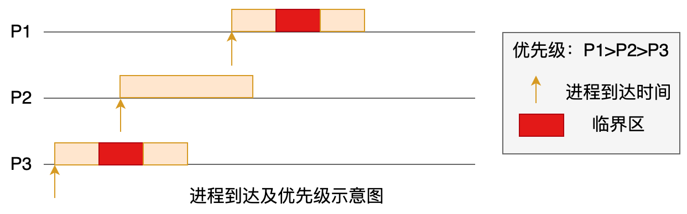
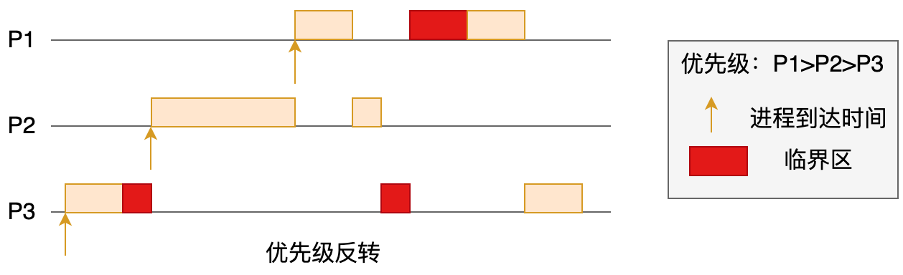
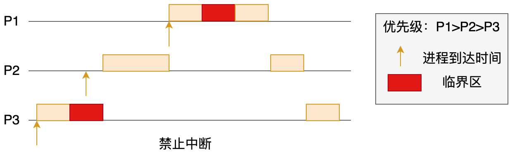
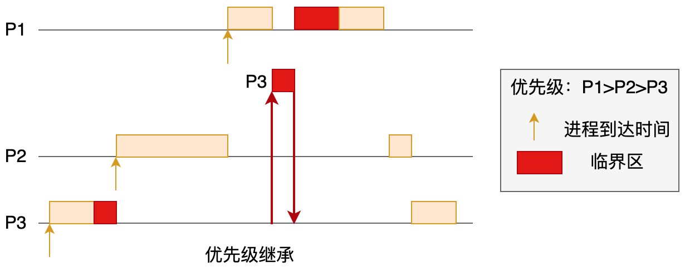
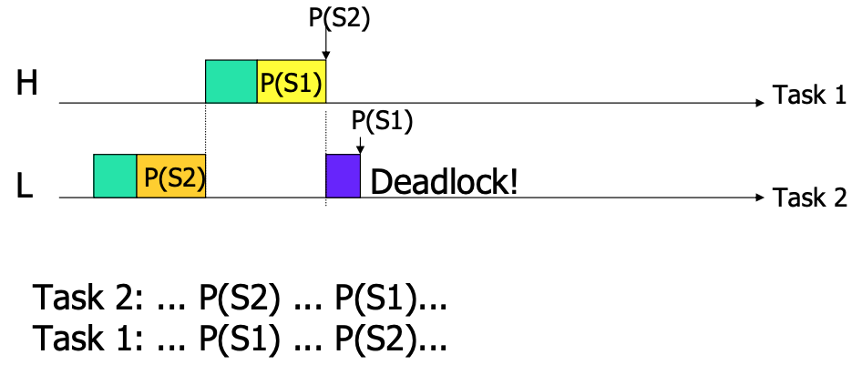
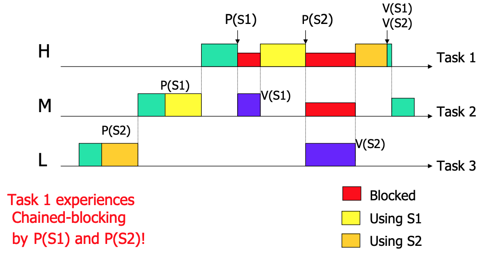
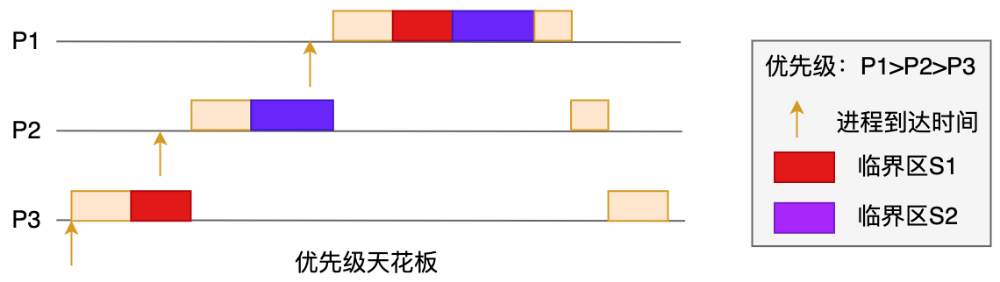

> 共享资源：在多个线程之间能被共享的变量称为共享变量。共享变量包括所有的实例变量，静态变量和数组元素，他们都放在堆内存中，Volatile只能作用于共享变量。

> 内存屏障: 是一组处理器指令，用于实现对内存操作的顺序限制。

> 缓冲行:缓存中可以分配的最小存储单位。

> 缓冲行填充：当处理器识别到从内存中读取操作数是可缓存的，处理器从缓存中读取操作数，而不是从内存中。

> 临界资源：在同一时间只能被一个进程调用的资源，也称互斥资源。

> 同步：保证访问的时序可控性，使调用资源的的顺序合理。

> 临界区指的是一个访问共用资源（例如：共用设备或是共用存储器）的程序片段，而这些共用资源又无法同时被多个线程访问的特性。当有线程进入临界区段时，其他线程或是进程必须等待（例如：bounded waiting 等待法），有一些同步的机制必须在临界区段的进入点与离开点实现，以确保这些共用资源是被互斥获得使用。

> 互斥：在进程调用临界资源是，不同进程之间要竞争该资源，那么一个进程调用了该资源，另一个进程无法再调用该资源的情形就叫互斥！

> 原子操作：该操作无法被打断

> 同步与互斥的作用：使访问临界资源时，具有安全性。

## 信号量Semaphore
例如一个宿舍有3把钥匙，来了5个人，慢来的两个人就得等待别人钥匙用完了，才能拿到钥匙，信号量
表示的是共享资源有效可被访问的数量，也就是3把钥匙。
多线程同步使用的；一个线程完成某个动作后通过信号告诉别的线程，别的线程才可以执行某些动作.
**信号量操作是原子操作**

 分类：
            二进制信号量（Binary Semaphore）：只允许信号量取0或1值，其同时只能被一个线程获取；
            整型信号量（Integer Semaphore）：信号量取值是整数，可被多个线程同时获得，直到信号量的值变为0；
            记录型信号量（Record Semaphore）：每个信号量s除以一个整数值value（计数）外，还有一个等待队列List，其中是阻塞在该信号量的各个线程的标识。
                当信号量被释放1个，值被加1后，系统自动从等待队列中唤醒一个等待中的线程；让其获得信号量，同时信号量再减1。
                
        Semaphore 抽象操作：
            create() / wait() / post() / trywait() / destroy()

## 死锁
> 例子:
保安：你不戴口罩不能出门。
我：我要出门才能买口罩。
保安：你不戴口罩我怎么让你出门？
我：我不出门我怎么拿口罩来戴？
java语言：即线程在获得了锁A并且没有释放的情况下去申请锁B，这时，另一个线程已经获得了锁B，在释放锁B之前又要先获得锁A。

```java
public class DeadLockA extends Thread {
    @Override
    public void run() {
        try{
            System.out.println("LockA running");
            while(true){
                synchronized(Client.obj1){
                    System.out.println("LockA locked obj1");
                    //获取obj1后先等一会儿，让LockB有足够的时间锁住obj2
                    Thread.sleep(100);
                    System.out.println("LockA trying to lock obj2...");
                    synchronized(Client.obj2){
                        System.out.println("LockA locked obj2");
                    }
                }
            }
        }catch(Exception e){
            e.printStackTrace();
        }
    }
}
public class DeadLockB extends Thread {
    @Override
    public void run() {
        try{
            System.out.println("LockB running");
            while(true){
                synchronized(Client.obj2){
                    System.out.println("LockB locked obj2");
                    System.out.println("LockB trying to lock obj1...");
                    synchronized(Client.obj1){
                        System.out.println("LockB locked obj1");
                    }
                }
            }
        }catch(Exception e){
            e.printStackTrace();
        }
    }
}
public class Client {
    public static final String obj1 = "obj1";
    public static final String obj2 = "obj2";

    public static void main(String[] ars) {
        new DeadLockA().start();
        new DeadLockB().start();
    } 
}
```
解决方案，要么调整锁的顺序，要么调整锁申请的范围。


## 优先级反转
> 高优先级任务被低优先级任务阻塞，导致高优先级任务迟迟得不到调度。但其他中等优先级的任务却能抢到CPU资源。-- 从现象上来看，好像是中优先级的任务比高优先级任务具有更高的优先权


**PV表示信号量，P表示通过的意思，V表示释放的意思；CS代表临界区**

```java
P1:   P; CS; V
P2:   program  （该线程没有持有临界区，也就没有被P3占用临界区的情况。）
P3:   P; CS; V
```


假设采用抢占式优先级调度算法，可以作出进程执行顺序，如下：



进程P3先到达，先运行，进程进入临界区；此时P2到达，P2优先级高于P3，抢占P3获得CPU执行权；P2运行一段时间，恰巧P1到达，P1优先级高于P2，抢占P2获得CPU执行权；P2运行到临界区，企图进入临界区，然而此时临界区被P3占用，P1不得以只能进入阻塞状态；现在CPU空闲，从[P2, P3]选取高优先级进程（即P2）运行（这里，低优先级进程P2执行，而高优先级P1只能干瞪眼，这种现象称为优先级反转）；P2运行完，轮到P3，P3运行完，释放临界区，P1进入就绪态，获得CPU执行权。

透过这个例子，我们可以发现优先级反转出现在一个高优先级任务等待访问一个被低优先级任务正在使用的临界资源，此时，高优先级任务阻塞了；同时，该低优先级任务被一个次高优先级的任务所抢先（preempt），导致低优先级任务得不到执行，无法及时地释放该临界资源。可见，高优先级任务和次高优先级任务的优先级反转了。

解决优先级反转方法有多种，包括禁止中断、禁止抢占、优先级继承、优先级天花板等.

## 解决优先级反转

* 不可抢占
这个执行就跟上面那个"进程达到及优先级示意图"一致，这个背离了优先级的设计初衷，不可取。
* 禁止中断
关闭中断，进入临界区；退出临界区，开中断。就是判断线程有没有在占用临时资源，如果有就把临时资源执行完，再执行优先级抢占。

禁止中断类似于不可抢占方式，只是粒度不像不可抢占那么极端。但有可能存在误杀，如果P1没有和P3竞争临界区的话，这种方式就浪费资源了。
* 优先级继承
优先级继承（priority inheritance）是指当高优先级进程（P1）请求一个已经被被低优先级（P3）占有的临界资源时，将低优先级进程（P3）的优先级临时提升到与高优先级进程一样的级别，使得低优先级进程能更快地运行，从而更快地释放临界资源。低优先级进程离开临界区后，其优先级恢复至原本的值。linux就使用了这种策略。

优先级存在的问题
（1）有可能出现死锁

高优先级任务T1请求被低优先级任务T2占有的临界资源S2，进入阻塞状态。尽管把T2优先级提高到与T1同样的水平，T2运行一段时间，当请求被T1占有的临界资源S1时，也会进入阻塞状态，此时死锁形成。
(2)有可能出现链阻塞

高优先级任务T1请求临界资源S1；中优先级任务T2优先级被提升，获得CPU执行权，释放S1；T1继续往前执行，但当请求临界资源S2时，低优先级任务T3优先级被提升，T3释放S2，T1得以继续执行。在这个例子中，T1被阻塞了两次。更极端例子，T1会被阻塞很多次，这个叫chained blocking。
* 优先级天花板
优先级天花板（priority ceiling）是指将申请某资源的任务的优先级提升到可能访问该资源的所有任务中最高优先级任务的优先级。
通俗一点来说，就是判断有几个线程都共同占有临界资源R，取最高那个优先级线程的优先级。
举例，如下图所示，进程[P1, P3]会访问临界资源S1，因此S1的优先级天花板为1；同理可得，S2的优先级天花板也为1。接下来看进程的执行顺序，P3成功占有临界资源S1，此时P3优先级被提升至1，顺利执行完临界区的代码，恢复优先级；P2抢占P3，同理，P2优先级提升至1，P2也可以执行完临界区的代码；P1抢占P2，此时，临界资源S1和S2皆已释放，P1可以一口气执行到底。可见，这里不存在链阻塞问题（chained blocking）。

但这样的策略有一个隐含前提，事先知道临界资源的优先级天花板，这在通用操作系统（比如Linux）很难做到，但在实时操作系统倒是有可能，μC/OS-II 2.52就实现了优先级天花板。

## 互斥信号量 Mutex
多线程互斥使用的；一个线程占用某个资源，那么别的线程就无法访问，直到该线程离开，其他线程才可以访问该资源；

如果用Mutex的方式，同时只有一个人可以使用咖啡机，他获得了咖啡机的使用权后，开始做咖啡，其他人只能在旁边等着，直到他做好咖啡后，另外一个人才能获得咖啡机的使用权。如果用Semaphore的模式，服务员会把咖啡做好放到柜台上，谁想喝咖啡就拿走一杯，服务员会不断做咖啡，如果咖啡杯被拿光了，想喝咖啡的人就排队等着。Mutex管理的是咖啡机的使用权，而Semaphore管理的是做好的咖啡数量。

互斥量表现互斥现象的数据结构，常用作保护从中断来的临界段代码并且在共享同步使用的资源；
        Mutex本质就是一把锁，提供对资源的独占式访问，所以Mutex主要的作用是互斥。
        Mutex 抽象操作：
            create() / lock() / unlock() / destroy()
互斥信号量与信号量：
https://blog.csdn.net/gongyuan073/article/details/8854720?depth_1-utm_source=distribute.pc_relevant.none-task-blog-BlogCommendFromBaidu-1&utm_source=distribute.pc_relevant.none-task-blog-BlogCommendFromBaidu-1
