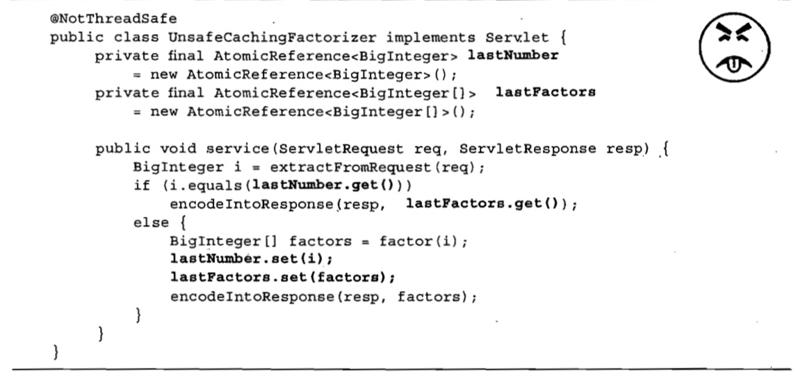

# 线程安全性
## 简介
当多线程访问某个类时，不管运行时环境采用何种调度方式或者这些线程将如何交替执行，并且在主调代码中不需要任何额外的同步或协同，这个类都能表现出正确的行为，那么就称这个类是线程安全的。

eg:例如局部变量 **和其他线程没有共享状态，就好像他们在访问不同的实例** 不会影响到其他线程中操作的正确性.
**无状态对象一定是线程安全的**
## 原子性
下面count自增在内存操作包括: read->update->write 3个步骤，并且其结果状态依赖于之前的状态，这样就会导致一个bug的出现，称为**竞态条件**
举个例子，你朋友去找你，你去找你朋友，在这期间就错过了。

```java
 private long count = 0;

    public long getCount() {
        return count;
    }
    private  void test() {
        count++;
    }
```
```java
    private StatelessFactor install = null;

    public StatelessFactor getInstall() {
        if (install == null)
            install = new StatelessFactor();
        return install;
    }
```
这个例子就包含了一个竞态条件，在某种不恰当的执行时序时，可能会破坏这个类的正确性，线程A和线程B同时执行，可能会产生两个不同的实例。
**原子：当有一个线程A在操作方法时，线程B要等待A操作完或者不执行这个方法。**
**原子操作是指对于访问同一状态的所有操作来说，这个操作是一个以原子的方式执行的操作**
* 1、采用AtomicLong方式来替代long类型的计数器
```java
  private final AtomicLong count = new AtomicLong(0);

    public long getCount() {
        return count.get();
    }
    private  void test() {
        count.incrementAndGet();
    }
```
* 2、采用加锁机制

> 尽管set方法的每次调用都是原子的，但仍然无法同时更新lastNumber和lastFactors。如果只修改了其中一个变量，那么在这两次修改操作之间，其他线程将发现不变性条件被破坏了，同样我们也不能保证会同时获取这两个值；在A获取这两个值的过程中，B有可能修改了它们，这样A也会发现不变性条件被破坏了

**要保持状态的一致性，就需要在单个原子操作中更新所有相关的状态变量。**
* 内置锁
