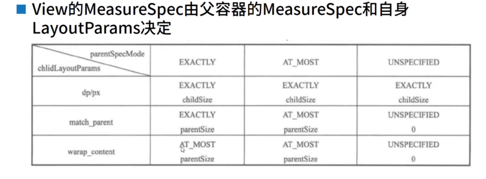

 
 https://blog.csdn.net/Mohon/article/details/51886611

 #####  View 是如何被添加到屏幕窗口上
 * 创建顶层布局容器DecorView
 * 在顶层布局中加载基础布局ViewGroup
 * 将ContentView 添加到基础布局中的FrameLayout中

 Activity # setContentView()
```
    -> PhoneWindow # setContentView()
        -> PhoneWindow # installDecor()
            -> PhoneWindow # generateDecor()  mDecor
            -> PhoneWindow # generateLayout() mContentParent
                ->mContentParent里面就是setContentView，id是                    content→FrameLayout 
```


容器  |  childCount  |  child
-|-|- 
Window | 1 | DecorView
DecorView(只有一个子孩子, 两种可能) | 1 | may1(一般都是这个): mContentRoot(根据feature拿到的layoutResource 例如: screen_simple.xml)<br/> may2: DecorCaptionView(管理拖拽的视图)
DecorCaptionView(作为了解) | 2 | child1: LinearLayout(@+id/caption)<br/>child2: mContentRoot<br/>(根据feature拿到的layoutResource 例如: screen_simple.xml)
mContentRoot(以screen_simple.xml为例) | 2 | child1: ViewStub(@+id/action_mode_bar_stub)<br/>child2: FrameLayout(@android:id/content), 看到这个ID就放心了, 它就是mCotnentParent
```java
DecorView

  void onResourcesLoaded(LayoutInflater inflater, int layoutResource) {
        mStackId = getStackId();

        if (mBackdropFrameRenderer != null) {
            loadBackgroundDrawablesIfNeeded();
            mBackdropFrameRenderer.onResourcesLoaded(
                    this, mResizingBackgroundDrawable, mCaptionBackgroundDrawable,
                    mUserCaptionBackgroundDrawable, getCurrentColor(mStatusColorViewState),
                    getCurrentColor(mNavigationColorViewState));
        }

        mDecorCaptionView = createDecorCaptionView(inflater);
        final View root = inflater.inflate(layoutResource, null);
        if (mDecorCaptionView != null) {
            if (mDecorCaptionView.getParent() == null) {
                // 把mDecorCaptionView添加进DecorView里面
                addView(mDecorCaptionView,
                        new ViewGroup.LayoutParams(MATCH_PARENT, MATCH_PARENT));
            }
            //把mContentRoot添加进mDecorCaptionView里面
            mDecorCaptionView.addView(root,
                    new ViewGroup.MarginLayoutParams(MATCH_PARENT, MATCH_PARENT));
        } else {

            // Put it below the color views.
            //mDecorCaptionView为null时，添加mContentRoot进DecorView里面
            addView(root, 0, new ViewGroup.LayoutParams(MATCH_PARENT, MATCH_PARENT));
        }
        mContentRoot = (ViewGroup) root;
        initializeElevation();
    }

      private DecorCaptionView createDecorCaptionView(LayoutInflater inflater) {
        DecorCaptionView decorCaptionView = null;
         ....省略
        if (!mWindow.isFloating() && isApplication && StackId.hasWindowDecor(mStackId)) {
            // Dependent on the brightness of the used title we either use the
            // dark or the light button frame.
            if (decorCaptionView == null) {
                decorCaptionView = inflateDecorCaptionView(inflater);
            }
            decorCaptionView.setPhoneWindow(mWindow, true /*showDecor*/);
        } else {
            decorCaptionView = null;
        }
        ....省略
        // Tell the decor if it has a visible caption.
        enableCaption(decorCaptionView != null);
        return decorCaptionView;
    }
    private DecorCaptionView inflateDecorCaptionView(LayoutInflater inflater) {
        final Context context = getContext();
        // We make a copy of the inflater, so it has the right context associated with it.
        inflater = inflater.from(context);
        final DecorCaptionView view = (DecorCaptionView) inflater.inflate(R.layout.decor_caption,
                null);
        setDecorCaptionShade(context, view);
        return view;
    }
decor_caption.xml
<com.android.internal.widget.DecorCaptionView 
        android:orientation="vertical"
        android:layout_width="match_parent"
        android:layout_height="match_parent"
        android:descendantFocusability="beforeDescendants" >
    <LinearLayout
            android:id="@+id/caption"
            android:layout_width="match_parent"
            android:layout_height="wrap_content"
            android:gravity="end"
            android:background="@drawable/decor_caption_title"
            android:focusable="false"
            android:descendantFocusability="blocksDescendants" >
       ....省略
       ....省略
    </LinearLayout>
</com.android.internal.widget.DecorCaptionView>
```


```java
   decorview 被添加到窗口的过程
      WindowManager.LayoutParams l = r.window.getAttributes();
     1、wm.addView(decor, l); 

     =>2、@Override
    public void addView(@NonNull View view, @NonNull ViewGroup.LayoutParams params) {
        applyDefaultToken(params);
        // mParentWindow = PhoneWindow
        mGlobal.addView(view, params, mContext.getDisplay(), mParentWindow);
    }
    =>3、
 public void addView(View view, ViewGroup.LayoutParams params,
            Display display, Window parentWindow) {
     ***省略***
        final WindowManager.LayoutParams wparams = (WindowManager.LayoutParams) params;
        if (parentWindow != null) {
            parentWindow.adjustLayoutParamsForSubWindow(wparams);
        } else {
            // If there's no parent, then hardware acceleration for this view is
            // set from the application's hardware acceleration setting.
            final Context context = view.getContext();
            if (context != null
                    && (context.getApplicationInfo().flags
                            & ApplicationInfo.FLAG_HARDWARE_ACCELERATED) != 0) {
                wparams.flags |= WindowManager.LayoutParams.FLAG_HARDWARE_ACCELERATED;
            }
        }

        ViewRootImpl root;
        View panelParentView = null;

        synchronized (mLock) {
            // Start watching for system property changes.
            if (mSystemPropertyUpdater == null) {
                mSystemPropertyUpdater = new Runnable() {
                    @Override public void run() {
                        synchronized (mLock) {
                            for (int i = mRoots.size() - 1; i >= 0; --i) {
                                mRoots.get(i).loadSystemProperties();
                            }
                        }
                    }
                };
                SystemProperties.addChangeCallback(mSystemPropertyUpdater);
            }

            int index = findViewLocked(view, false);
            if (index >= 0) {
                if (mDyingViews.contains(view)) {
                    // Don't wait for MSG_DIE to make it's way through root's queue.
                    mRoots.get(index).doDie();
                } else {
                    throw new IllegalStateException("View " + view
                            + " has already been added to the window manager.");
                }
                // The previous removeView() had not completed executing. Now it has.
            }

            // If this is a panel window, then find the window it is being
            // attached to for future reference.
            if (wparams.type >= WindowManager.LayoutParams.FIRST_SUB_WINDOW &&
                    wparams.type <= WindowManager.LayoutParams.LAST_SUB_WINDOW) {
                final int count = mViews.size();
                for (int i = 0; i < count; i++) {
                    if (mRoots.get(i).mWindow.asBinder() == wparams.token) {
                        panelParentView = mViews.get(i);
                    }
                }
            }

            root = new ViewRootImpl(view.getContext(), display);

            view.setLayoutParams(wparams);

            mViews.add(view);
            mRoots.add(root);
            mParams.add(wparams);
        }

        // do this last because it fires off messages to start doing things
        try {
            //ViewRootImpl类  
            // 关联decorview和Phonewindow的parms和PhoneWindow
            root.setView(view, wparams, panelParentView);
        } catch (RuntimeException e) {
            // BadTokenException or InvalidDisplayException, clean up.
            synchronized (mLock) {
                final int index = findViewLocked(view, false);
                if (index >= 0) {
                    removeViewLocked(index, true);
                }
            }
            throw e;
        }
    }
    ==>
    4、
  public void setView(View view, WindowManager.LayoutParams attrs, View panelParentView) {
        synchronized (this) {
            if (mView == null) {
                   mView = view;
                   **一些初始化参数之类的代码**
                //   // Schedule the first layout -before- adding to the window
                // manager, to make sure we do the relayout before receiving
                // any other events from the system.
                requestLayout();//将其重绘
                   ****
                     view.assignParent(this);//将父类进行关联

            }
        }
  }
  onResume()
   ActivityThread(handlerResumeActivity()) -> WindowsManagerImpl (addView()) -> WindowManagerGlobal (addView())
   -> ViewRootImpl(setView()) -> requestLayout() ->ViewRootImpl scheduleTraversals()
   ->ViewRootImpl TraversalRunnable doTraversal()->performTraversals()->进入view的绘制过程
     @Override
    public void requestLayout() {
        if (!mHandlingLayoutInLayoutRequest) {
            checkThread();
            mLayoutRequested = true;
            scheduleTraversals();
        }
    }

   //这个方法太长了 只调出重点
    private void performTraversals() {
        // cache mView since it is used so much below...
        final View host = mView;
        /** View树遍历的主要三个步骤measure、layout、draw **/  
        ......  
         boolean layoutRequested = mLayoutRequested && (!mStopped || mReportNextDraw);
    
      if (layoutRequested) {
            mLayoutRequested = false;
        }
         boolean windowShouldResize = layoutRequested && windowSizeMayChange
            && ....;
            
        if (mFirst || windowShouldResize || insetsChanged ||
                viewVisibilityChanged || params != null || mForceNextWindowRelayout) {
                   
                     performMeasure(childWidthMeasureSpec, childHeightMeasureSpec);  
                
                }

        ......  
         final boolean didLayout = layoutRequested && (!mStopped || mReportNextDraw);
        if (didLayout) {
        performLayout(lp, desiredWindowWidth, desiredWindowHeight);  
        }
                ......
        if (!cancelDraw && !newSurface) {
            if (!skipDraw || mReportNextDraw) {
                ......
                performDraw();
            }
        } else {
            if (viewVisibility == View.VISIBLE) {
                // Try again
                scheduleTraversals();
            } else if (mPendingTransitions != null && mPendingTransitions.size() > 0) {
                for (int i = 0; i < mPendingTransitions.size(); ++i) {
                    mPendingTransitions.get(i).endChangingAnimations();
                }
                mPendingTransitions.clear();
            }
        }
    ......
    }
    performMeasure、performLayout、performDraw内部依次调用view的绘制流程方法。
    mView.measure(childWidthMeasureSpec, childHeightMeasureSpec); 
    host.layout(0, 0, host.getMeasuredWidth(), host.getMeasuredHeight());  
    draw(fullRedrawNeeded); 
```
#### 总结
* View 的 requestLayout 和 invalidate 处理的方式很相似, 都是从当前 View 回溯到 ViewRootImpl 中去调用 scheduleTraversals 重新开启 View 绘制的三大流程
* requestLayout 会通过 mLayoutRequested 这个 Flag 来控制是否执行 performMeasure 和 performLayout
* invalidate 时 mLayoutRequested 为 false, 故不会执行 performMeasure 和 performLayout, 只会执行 performDraw, 当然 performDraw 的执行也是有条件限制的, 不过与 mLayoutRequested 无关
* postInvalidate 与 invalidate 本质上没什么不同, 只不过 postInvalidate 可以在非 UI 创建线程中去通知 View 重绘, 当然了原理及是 Android 消息机制
* 由源代码可以看出，当newSurface为真时，performTraversals函数并不会调用performDraw函数，而是调用scheduleTraversals函数，从而再次调用一次performTraversals函数，从而再次进行一次测量，布局和绘制过程。
 我们由断点调试可以轻易看到，第一次performTraversals时的newSurface为真，而第二次时是假。
### view的绘制流程


* View = 模式 + 尺寸->MeasureSpec 32位int值
00      0....0(30位)
(模式)  (尺寸)

```java
       private static final int MODE_SHIFT = 30;
       private static final int MODE_MASK  = 0x3 << MODE_SHIFT;
       //11 0...0

    //  父容器不对View做任何限制，系统内部使用
     public static final int UNSPECIFIED = 0 << MODE_SHIFT;   //00 0....0

// 父容器检测出View的大小，View的大小就是SpecSize,LayoutParms match_parent 固定大小
        public static final int EXACTLY     = 1 << MODE_SHIFT;//01 0....0

// 父容器指定一个可用大小，View的大小不能超过这个值，LayoutPamras wrap_content
        public static final int AT_MOST     = 2 << MODE_SHIFT;//10 0....0 

 
 public static int makeMeasureSpec(@IntRange(from = 0, to = (1 << MeasureSpec.MODE_SHIFT) - 1) int size,
                                          @MeasureSpecMode int mode) {
            if (sUseBrokenMakeMeasureSpec) {
                return size + mode;
            } else {
                return (size & ~MODE_MASK) | (mode & MODE_MASK);
                // 1、~MODE_MASK ： 00 1...1  MODE_MASK : 11 0...0
                // 2、size & ~MODE_MASK 00 size(后30位)
                // 3、mode & MODE_MASK  mode(前两位) 0....0
                // 4、 (size & ~MODE_MASK) | (mode & MODE_MASK) 
                // mode前两位和size后30位进行一个结合

            }
        }
         @MeasureSpecMode
        public static int getMode(int measureSpec) {
            //noinspection ResourceType
            return (measureSpec & MODE_MASK);
            // 1、MODE_MASK : 11 0...0
            // measureSpec & MODE_MASK 取出mode的前两位
        }
         public static int getSize(int measureSpec) {
            return (measureSpec & ~MODE_MASK);//取出后30位
        }

  
    // mView 是DecorView
  private void performMeasure(int childWidthMeasureSpec, int childHeightMeasureSpec) {
        Trace.traceBegin(Trace.TRACE_TAG_VIEW, "measure");
        try {
            mView.measure(childWidthMeasureSpec, childHeightMeasureSpec);
        } finally {
            Trace.traceEnd(Trace.TRACE_TAG_VIEW);
        }
    }
    // 实际上就会调用到DecorView的onMeasure，进而调用到FrameLayout的onMeasure

 protected void onMeasure(int widthMeasureSpec, int heightMeasureSpec) {
        int count = getChildCount();

        final boolean measureMatchParentChildren =
                MeasureSpec.getMode(widthMeasureSpec) != MeasureSpec.EXACTLY ||
                MeasureSpec.getMode(heightMeasureSpec) != MeasureSpec.EXACTLY;
        mMatchParentChildren.clear();

        int maxHeight = 0;
        int maxWidth = 0;
        int childState = 0;

        for (int i = 0; i < count; i++) {
            final View child = getChildAt(i);
            if (mMeasureAllChildren || child.getVisibility() != GONE) {
                measureChildWithMargins(child, widthMeasureSpec, 0, heightMeasureSpec, 0);
                final LayoutParams lp = (LayoutParams) child.getLayoutParams();
                maxWidth = Math.max(maxWidth,
                        child.getMeasuredWidth() + lp.leftMargin + lp.rightMargin);
                maxHeight = Math.max(maxHeight,
                        child.getMeasuredHeight() + lp.topMargin + lp.bottomMargin);
                childState = combineMeasuredStates(childState, child.getMeasuredState());
                if (measureMatchParentChildren) {
                    if (lp.width == LayoutParams.MATCH_PARENT ||
                            lp.height == LayoutParams.MATCH_PARENT) {
                        mMatchParentChildren.add(child);
                    }
                }
            }
        }

        // Account for padding too
        // 考虑到padding
        maxWidth += getPaddingLeftWithForeground() + getPaddingRightWithForeground();
        maxHeight += getPaddingTopWithForeground() + getPaddingBottomWithForeground();

        // Check against our minimum height and width
        // 得到最大的宽和高
        // getSuggestedMinimumHeight 最小高度
        maxHeight = Math.max(maxHeight, getSuggestedMinimumHeight());
        maxWidth = Math.max(maxWidth, getSuggestedMinimumWidth());

        // Check against our foreground's minimum height and width
        final Drawable drawable = getForeground();
        if (drawable != null) {
            maxHeight = Math.max(maxHeight, drawable.getMinimumHeight());
            maxWidth = Math.max(maxWidth, drawable.getMinimumWidth());
        }
        // 设置控件的一个宽高
        setMeasuredDimension(resolveSizeAndState(maxWidth, widthMeasureSpec, childState),
                resolveSizeAndState(maxHeight, heightMeasureSpec,
                        childState << MEASURED_HEIGHT_STATE_SHIFT));

        count = mMatchParentChildren.size();
        if (count > 1) {
            for (int i = 0; i < count; i++) {
                final View child = mMatchParentChildren.get(i);
                final MarginLayoutParams lp = (MarginLayoutParams) child.getLayoutParams();

                final int childWidthMeasureSpec;
                if (lp.width == LayoutParams.MATCH_PARENT) {
                    final int width = Math.max(0, getMeasuredWidth()
                            - getPaddingLeftWithForeground() - getPaddingRightWithForeground()
                            - lp.leftMargin - lp.rightMargin);
                    childWidthMeasureSpec = MeasureSpec.makeMeasureSpec(
                            width, MeasureSpec.EXACTLY);
                } else {
                    childWidthMeasureSpec = getChildMeasureSpec(widthMeasureSpec,
                            getPaddingLeftWithForeground() + getPaddingRightWithForeground() +
                            lp.leftMargin + lp.rightMargin,
                            lp.width);
                }

                final int childHeightMeasureSpec;
                if (lp.height == LayoutParams.MATCH_PARENT) {
                    final int height = Math.max(0, getMeasuredHeight()
                            - getPaddingTopWithForeground() - getPaddingBottomWithForeground()
                            - lp.topMargin - lp.bottomMargin);
                    childHeightMeasureSpec = MeasureSpec.makeMeasureSpec(
                            height, MeasureSpec.EXACTLY);
                } else {
                    childHeightMeasureSpec = getChildMeasureSpec(heightMeasureSpec,
                            getPaddingTopWithForeground() + getPaddingBottomWithForeground() +
                            lp.topMargin + lp.bottomMargin,
                            lp.height);
                }

                child.measure(childWidthMeasureSpec, childHeightMeasureSpec);
            }
        }
    }
    // ------View.java---------
    protected void onMeasure(int widthMeasureSpec, int heightMeasureSpec) {
        setMeasuredDimension(getDefaultSize(getSuggestedMinimumWidth(), widthMeasureSpec),
                getDefaultSize(getSuggestedMinimumHeight(), heightMeasureSpec));
    }

      public static int getDefaultSize(int size, int measureSpec) {
        int result = size;
        int specMode = MeasureSpec.getMode(measureSpec);
        int specSize = MeasureSpec.getSize(measureSpec);

        switch (specMode) {
        case MeasureSpec.UNSPECIFIED:
            result = size;
            break;
        case MeasureSpec.AT_MOST:
        case MeasureSpec.EXACTLY:
            result = specSize;
            break;
        }
        return result;
    }

          /**
        *得到widthSpec和heightSpec的值  结合成前两位是模式，后30位是尺寸
        的二进制
        *@parms windowSize父布局的大小
        *@parms rootDimension 本身布局的大小
        */
    private static int getRootMeasureSpec(int windowSize, int rootDimension) {
        int measureSpec;
        switch (rootDimension) {

        case ViewGroup.LayoutParams.MATCH_PARENT:
            // Window can't resize. Force root view to be windowSize.
            measureSpec = MeasureSpec.makeMeasureSpec(windowSize, MeasureSpec.EXACTLY);
            break;
        case ViewGroup.LayoutParams.WRAP_CONTENT:
            // Window can resize. Set max size for root view.
            measureSpec = MeasureSpec.makeMeasureSpec(windowSize, MeasureSpec.AT_MOST);
            break;
        default:
            // Window wants to be an exact size. Force root view to be that size.
            measureSpec = MeasureSpec.makeMeasureSpec(rootDimension, MeasureSpec.EXACTLY);
            break;
        }
        return measureSpec;
    }


    // spec 父容器的测量规格
    // padding 使用空间  mPadingleft+mPaddingRight
    // +lp.leftmargin+lp.rightMar+widUser(width的使用空间)
    // child的尺寸 lp.width
    getChildMeasureSpec(spec,padding,childDimension)

      public static int getChildMeasureSpec(int spec, int padding, int childDimension) {
        int specMode = MeasureSpec.getMode(spec);
        int specSize = MeasureSpec.getSize(spec);

        int size = Math.max(0, specSize - padding);

        int resultSize = 0;
        int resultMode = 0;

        switch (specMode) {
        // Parent has imposed an exact size on us
        case MeasureSpec.EXACTLY:
            if (childDimension >= 0) {
                resultSize = childDimension;
                resultMode = MeasureSpec.EXACTLY;
            } else if (childDimension == LayoutParams.MATCH_PARENT) {
                // Child wants to be our size. So be it.
                resultSize = size;
                resultMode = MeasureSpec.EXACTLY;
            } else if (childDimension == LayoutParams.WRAP_CONTENT) {
                // Child wants to determine its own size. It can't be
                // bigger than us.
                resultSize = size;
                resultMode = MeasureSpec.AT_MOST;
            }
            break;

        // Parent has imposed a maximum size on us
        case MeasureSpec.AT_MOST:
            if (childDimension >= 0) {
                // Child wants a specific size... so be it
                resultSize = childDimension;
                resultMode = MeasureSpec.EXACTLY;
            } else if (childDimension == LayoutParams.MATCH_PARENT) {
                // Child wants to be our size, but our size is not fixed.
                // Constrain child to not be bigger than us.
                resultSize = size;
                resultMode = MeasureSpec.AT_MOST;
            } else if (childDimension == LayoutParams.WRAP_CONTENT) {
                // Child wants to determine its own size. It can't be
                // bigger than us.
                resultSize = size;
                resultMode = MeasureSpec.AT_MOST;
            }
            break;

        // Parent asked to see how big we want to be
        case MeasureSpec.UNSPECIFIED:
            if (childDimension >= 0) {
                // Child wants a specific size... let him have it
                resultSize = childDimension;
                resultMode = MeasureSpec.EXACTLY;
            } else if (childDimension == LayoutParams.MATCH_PARENT) {
                // Child wants to be our size... find out how big it should
                // be
                resultSize = View.sUseZeroUnspecifiedMeasureSpec ? 0 : size;
                resultMode = MeasureSpec.UNSPECIFIED;
            } else if (childDimension == LayoutParams.WRAP_CONTENT) {
                // Child wants to determine its own size.... find out how
                // big it should be
                resultSize = View.sUseZeroUnspecifiedMeasureSpec ? 0 : size;
                resultMode = MeasureSpec.UNSPECIFIED;
            }
            break;
        }
        //noinspection ResourceType
        return MeasureSpec.makeMeasureSpec(resultSize, resultMode);
    }

```
## View Measure过程


* 测量
ViewGroup measure ->  onMeasure(测量子控件的宽高) -> setMeasuredDimension
-->setMeasuredDimensionRaw 
View measure ->onMeasure(测量子控件的宽高) ->setMeasuredDimension ->setMeasuredDimensionRaw

match_parent EXACTLY wrap_content AT_MOST   ====>getRootMeasureSpec 方法中得到

mode+size=MeasureSpec

## View的Measure总结


* 布局
//mWidth 顶层布局的宽，mHeight 顶层布局的高
performLayout(lp,mWidth,mHeight);
```java
 private void performLayout(WindowManager.LayoutParams lp, int desiredWindowWidth,
            int desiredWindowHeight) {
        mLayoutRequested = false;
        mScrollMayChange = true;
        mInLayout = true;
***省略***
        final View host = mView;//mDecorView
        try {
            // layout=>view.layout确定左上右下的值 =>onLayout
            host.layout(0, 0, host.getMeasuredWidth(), host.getMeasure  dHeight());

            mInLayout = false;
            int numViewsRequestingLayout = mLayoutRequesters.size();
            if (numViewsRequestingLayout > 0) {
                ArrayList<View> validLayoutRequesters = getValidLayoutRequesters(mLayoutRequesters,
                        false);
                if (validLayoutRequesters != null) {
                    mHandlingLayoutInLayoutRequest = true;

                    int numValidRequests = validLayoutRequesters.size();
                    for (int i = 0; i < numValidRequests; ++i) {
                        final View view = validLayoutRequesters.get(i);
                        Log.w("View", "requestLayout() improperly called by " + view +
                                " during layout: running second layout pass");
                        view.requestLayout();
                    }
                    measureHierarchy(host, lp, mView.getContext().getResources(),
                            desiredWindowWidth, desiredWindowHeight);
                    mInLayout = true;
                    host.layout(0, 0, host.getMeasuredWidth(), host.getMeasuredHeight());

                    mHandlingLayoutInLayoutRequest = false;

                    validLayoutRequesters = getValidLayoutRequesters(mLayoutRequesters, true);
                    if (validLayoutRequesters != null) {
                        final ArrayList<View> finalRequesters = validLayoutRequesters;
                        getRunQueue().post(new Runnable() {
                            @Override
                            public void run() {
                                int numValidRequests = finalRequesters.size();
                                for (int i = 0; i < numValidRequests; ++i) {
                                    final View view = finalRequesters.get(i);
                                    Log.w("View", "requestLayout() improperly called by " + view +
                                            " during second layout pass: posting in next frame");
                                    view.requestLayout();
                                }
                            }
                        });
                    }
                }

            }
        } finally {
            Trace.traceEnd(Trace.TRACE_TAG_VIEW);
        }
        mInLayout = false;
        
    }
  
```
# layout 绘制总结

  // layout() 确定上下左右位置 
    // onLayout()控件位置的摆放
    /*
    调用view.layout确定自身的位置， 即确定mLeft,mTop,mRight,mBottom
    如果是ViewGroup类型，需要调用onLayoout确定子View的位置 
     */
     eg:
     FrameLayout.java
     onlayout=>layoutChildren  遍历子view并进行子控件位置的摆放,并调用child.layout()的方法，形成了
     一个递归的操作
  * 3、绘制
    performDraw=>draw=>drawSoftware=>mView.draw(canvas)[mDecorView]
    =>view.draw(canvas) 
     1、绘制背景 
     2、如果需要，进行图层的保存 
     3、绘制view的内容 onDraw 
     4、绘制子控件的内容 dispatchDraw
     5、绘制前景onDrawForeground 
     6、绘制装饰，如滚动条等等 drawDefaultFocusHighlight
    ViewGroup  => dispatchDraw   =>  drawChild =>child.draw    
    drawBackground =>onDraw =>dispatchDraw =>onDrawForeground
    View =>
  drawBackground =>onDraw =>onDrawForeground

* 布局总结
ViewGroup layout确定4个点的位置 ==>onLayout方法，负责子View的布局
View layout 确定自己的位置

onMeasure=>onLayout=>onDraw(可选)